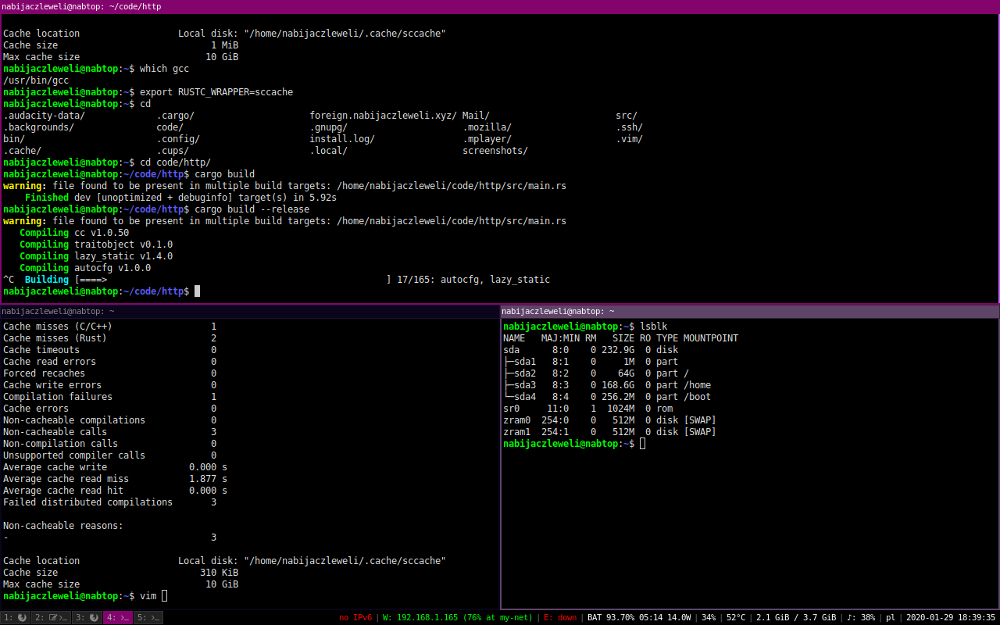
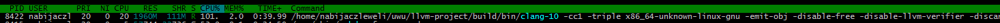
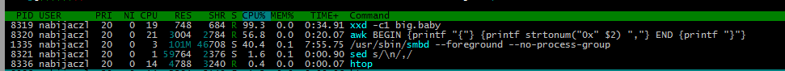

# topfig 
Assorted config/tooling/lube from the [nabtop](https://twitter.com/nabijaczleweli/status/1213277562434142211)

### [`src/adjust-screen-brightness.rs`](src/adjust-screen-brightness.rs)

Change `/sys/class/backlight/acpi_video0/brightness` by the amount specified as the first argument, clamped to `0..=max_brightness`.

Needs to be installed suid, see toplevel doc-comment.

### [`src/getxkblayout.c`](src/getxkblayout.c)

Get the current X keyboard layout in `localectl set-x11-keymap LAYOUT`/`setxkbmap -layout` format ("pl", "ru", &c.).

Based on https://unix.stackexchange.com/a/422493/162189, see [`src/deps`](src/deps) for build dependencies.

### [`src/i3status`](src/i3status)

The following patches to [`i3status`](https://github.com/i3/i3status):

1. [`0001-Don-t-pad-CPU-usage-to-2-characters.patch`](src/i3status/0001-Don-t-pad-CPU-usage-to-2-characters.patch):
   the `cpu_usage` metric is padded with `%02d` by default,
   this replaces that behaviour with `%d`.
2. [`0002-Count-all-CPUs-for-general-cpu_usage.patch`](src/i3status/0002-Count-all-CPUs-for-general-cpu_usage.patch):
   `cpu_usage` of all CPUs is scaled between 0-100 by default,
   this replaces that behaviour with summing each CPU's load together instead for a scaling of 0-(ncpus\*100).

### [`src/st`](src/st)

The following patches to [`st`](http://st.suckless.org):

1. [`0001-boxdraw_v2-custom-render-lines-blocks-braille-for-pe.patch`](src/st/0001-boxdraw_v2-custom-render-lines-blocks-braille-for-pe.patch):
   [boxdraw (0.8.2)](http://st.suckless.org/patches/boxdraw) patch, plus `boxdraw = 1` config.
2. [`0002-scrollback-mouse-scrollback.patch`](src/st/0002-scrollback-mouse-scrollback.patch):
   [scrollback](http://st.suckless.org/patches/scrollback), plus `mousescrollincrement = 3` config.
   Includes the following patchs:
    * `st-scrollback-20190331-21367a0.diff`
    * `st-scrollback-mouse-20191024-a2c479c.diff`
    * `st-scrollback-mouse-altscreen-20191024-a2c479c.diff`
    * `st-scrollback-mouse-increment-0.8.2.diff`
3. [`0003-Apply-ISO-14755-patch.patch`](src/st/0003-Apply-ISO-14755-patch.patch):
   [ISO 14755](http://st.suckless.org/patches/iso14755/st-iso14755-20180911-67d0cb6.diff) patch.
3. [`0004-Properly-mark-Del-as-P-in-terminfo.patch`](src/st/0004-Properly-mark-Del-as-P-in-terminfo.patch):
   marks Del as `kdch1` in terminfo making bash handle it correctly without a `.inputrc`, but breaks vim for some reason.
4. [`0005-Use-default-monospace-font.patch`](src/st/0005-Use-default-monospace-font.patch):
   use request monospace font instead of Liberation Mono.

### [`bin/idle-suspend`](bin/idle-suspend)

Wait the specified delay, then, if the idle time of `$DISPLAY` is greater therethan, suspend the machine, e.g. for use with `xss-lock`.

### [`bin/i3status++`](bin/i3status++)

Wraps `i3status` in `i3bar` mode modifying the status line as follows:
  * the current keyboard layout to the left of `tztime`
  * the current power draw from `BAT1` at the end of its sexion

### [`.config/i3`](.config/i3), [`.config/i3status`](.config/i3status)

i3 and i3status config, of note:
  * suspend after three minutes of inactivity via [`idle-suspend`](#binidle-suspend)
  * [`i3status++`](#bini3status)-based bar
  * media-key-based brightness adjust via [`adjust-screen-brightness`](#srcadjust-screen-brightnessrs)
  * [`.config/i3/app-icons.json`](.config/i3/app-icons.json) for [`i3-workspace-names-daemon`](https://github.com/cboddy/i3-workspace-names-daemon)
  * [baba is uwu](https://wiittyusername.tumblr.com/post/183597057765/baba-is-uwu)-inspired colour scheme:

### [`.config/sway`](.config/sway)

[sway](https://github.com/swaywm/sway) config mirroring the above X/i3 setup.

However, at the time of writing (2020-01-31 19:10:55), two issues prevent me from switching to sway:
  * the window bars are padded around the text signiifcantly more than in i3 (am i being a diva about this? probably; does it bother me? yes; could i patch sway to fix it? maybe, however)
  * [SolveSpace](http://solvespace.com) not creating GL context

### [`.config/htop`](.config/htop/htoprc)

`htop` config, of [@ThePhD](https://github.com/ThePhD/dotfiles/commit/e64186c944b5f08ac9e0e2a8498498dccbd22707) fame, laptopified.

